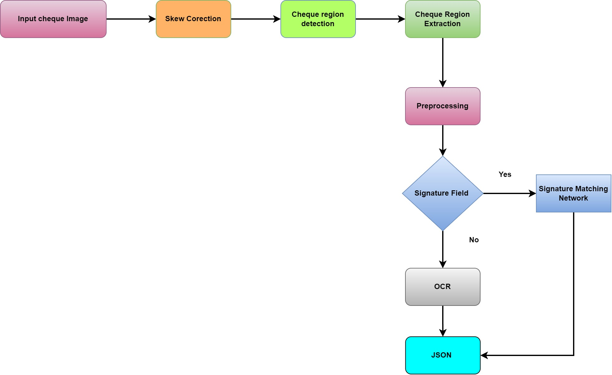
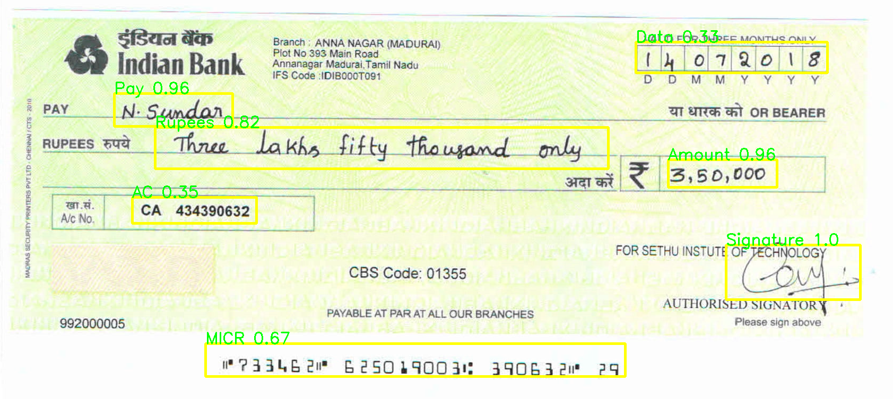

# Cheque Extract

Automatic cheque extraction module using deep learning.  This is a tensorflow implementation of a CNN for cheque region detection and text recognition.  I have trained the SSD efficienet0 for detecting the region in the cheque.

# Dependencies
 
- Python 3.7.14 
- paddleocr>=2.0.1
- tensorflow ==2.7.0
- pytesseract 
- opencv
- deskew
- PIL
- six


# Testing

```

python main.py --testImagePath="cheque image folder"

```


<p align="center">
 
<p align="center">


# Object detection results:

<p align="center">
 
<p align="center">

# Sample JSON output: 

````
{'Pay': {'ocr': 'N-Sundan',
  'pos': array([215, 176, 438, 238]),
  'confidence': 0.8580901622772217},
 'Amount': {'ocr': '3,50,000',
  'pos': array([1259,  301, 1464,  353]),
  'confidence': 0.8223406076431274},
 'Rupees': {'ocr': 'Lakhs fifty thougand only',
  'pos': array([ 292,  240, 1146,  318]),
  'confidence': 0.8862424492835999},
 'MICR': {'ocr': 'c733462c 62501900301 390632c 29\n\x0c',
  'pos': array([ 387,  648, 1178,  710])},
 'AC': {'ocr': 'CA 434390632',
  'pos': array([249, 372, 483, 421]),
  'confidence': 0.9562502503395081},
 'Data': {'ocr': '0',
  'pos': array([1198,   79, 1559,  137]),
  'confidence': 0.608750581741333}}


````
